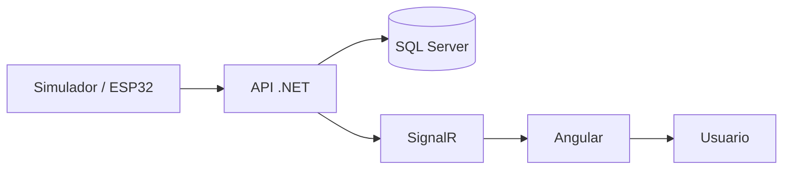

# ClimGuard
## Sistema Web de Monitoreo y Alerta Temprana para Riesgos Climáticos

**Curso:** Desarrollo Web  
**Tecnologías:** Angular 20, .NET 10, SQL Server 2022, SignalR, Docker  
**Versión:** 1.0

---

# 1. Introducción

Los fenómenos climáticos representan una amenaza constante para las comunidades, especialmente aquellas ubicadas en zonas rurales donde el acceso oportuno a información puede ser limitado. La falta de un sistema que centralice el monitoreo de variables ambientales dificulta la detección temprana de condiciones de riesgo, retrasando la toma de decisiones ante posibles emergencias.

ClimGuard surge como una solución tecnológica orientada al monitoreo y gestión de información climática en tiempo real. La plataforma permitirá visualizar las lecturas proveniente de sensores ambientales, detectar automáticamente condiciones de riesgo, generar alertas tempranas y almacenar un historial de eventos para facilitar el seguimiento de incidentes.

El sistema ha sido concebido bajo una arquitectura escalable que permite operar inicialmente con datos simulados y evolucionar posteriormente hacia una integración con dispositivos IoT y sensores físicos, sin requerir cambios significativos en la arquitectura del software.

---

# 2. Planteamiento del Problema

Las comunidades expuestas a riesgos climáticos requieren información confiable y oportuna para responder de manera adecuada ante eventos como inundaciones, tormentas, sequías, heladas o incendios forestales. Sin embargo, muchos sistemas de monitoreo presentan limitaciones relacionadas con la centralización de la información, la generación automática de alertas y el almacenamiento histórico de los eventos registrados.

La ausencia de una plataforma que integre estas funcionalidades dificulta el monitoreo continuo de las condiciones ambientales y limita la capacidad de reacción de los responsables de la gestión del riesgo.

---

# 3. Justificación

El desarrollo de ClimGuard contribuirá a la creación de una plataforma capaz de centralizar el monitoreo de variables climáticas, automatizar la generación de alertas y facilitar la gestión de eventos mediante una arquitectura moderna, escalable y preparada para futuras integraciones con dispositivos IoT.

Además de cumplir con los objetivos académicos del curso, el sistema estará preparado para integrarse con microcontroladores y sensores ambientales reales, permitiendo su evolución hacia una solución IoT orientada al monitoreo climático.

---

# 4. Objetivo General

Desarrollar un sistema web que permita monitorear variables climáticas en tiempo real, detectar automáticamente condiciones de riesgo, generar alertas tempranas y administrar el historial de eventos mediante una plataforma web segura, escalable y preparada para integrarse con sensores físicos.

---

# 5. Objetivos Específicos
- Administrar comunidades, sensores y usuarios del sistema.
- Visualizar en tiempo real las variables climáticas provenientes de sensores simulados o físicos.
- Detectar automáticamente condiciones de riesgo según umbrales previamente establecidos.
- Generar alertas clasificadas por niveles de peligro.
- Mantener un historial de lecturas y eventos registrados.
- Diseñar una arquitectura escalable que facilite la incorporación de nuevas comunidades, sensores y tecnologías IoT.

---

# 6. Alcance

ClimGuard permitirá administrar múltiples comunidades y los sensores asociados a cada una de ellas, mostrando información climática en tiempo real mediante un panel de monitoreo.

El sistema registrará las lecturas recibidas, generará alertas automáticas cuando se detecten condiciones de riesgo y almacenará el historial correspondiente para su posterior consulta.

Inicialmente el sistema trabajará con datos simulados; sin embargo, su arquitectura permitirá sustituir esta fuente de datos por sensores físicos conectados mediante un microcontrolador, sin modificar el funcionamiento del resto de la aplicación.

---

# 7. Tecnologías

## Frontend
- Angular 20

## Backend
- .NET 10 Web API

## Base de Datos
- SQL Server 2022

## Comunicación en tiempo real
- SignalR

## Contenedores
- Docker

## Control de versiones
- Git y GitHub

---

# 8. Arquitectura General

ClimGuard estará compuesto por una aplicación web desarrollada en Angular, una API REST implementada en .NET y una base de datos SQL Server.

La comunicación entre el frontend y el backend se realizará mediante servicios REST, mientras que las actualizaciones en tiempo real serán transmitidas utilizando SignalR.

La arquitectura permitirá recibir información tanto de un simulador de sensores como de dispositivos físicos conectados mediante un microcontrolador, garantizando la escalabilidad del sistema.

---

# 9. Organización de la Documentación

La documentación del proyecto estará organizada en documentos independientes que describen cada etapa del desarrollo, incluyendo requerimientos, historias de usuario, diagramas UML, arquitectura, diseño de base de datos, API REST y despliegue del sistema.