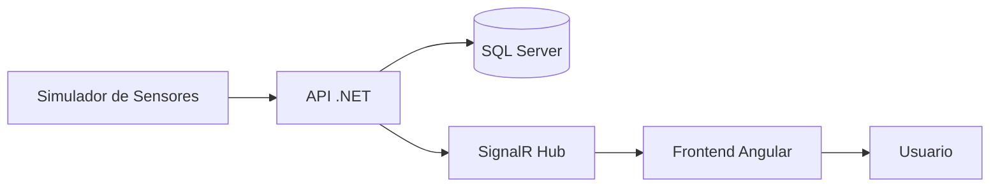

# ClimGuard
## Sistema Web de Monitoreo y Alerta Temprana para Riesgos Climáticos

**Curso:** Desarrollo Web  
**Tecnologías:** Angular 20, .NET 10, SQL Server 2022, SignalR, Docker Compose  
**Versión:** 1.0

---

# DOC-01. Introducción al Proyecto

## 1. Introducción

Los fenómenos climáticos representan una amenaza constante para las comunidades, especialmente aquellas ubicadas en zonas rurales donde el acceso oportuno a información puede ser limitado. La falta de un sistema que centralice el monitoreo de variables ambientales dificulta la detección temprana de condiciones de riesgo, retrasando la toma de decisiones ante posibles emergencias.

**ClimGuard** es un sistema web de monitoreo y alerta temprana para riesgos climáticos que permite visualizar en tiempo real las lecturas provenientes de sensores ambientales, detectar automáticamente condiciones de riesgo mediante umbrales configurables, generar alertas, administrar comunidades, sensores y usuarios, así como mantener un historial de eventos para facilitar el seguimiento de incidentes.

El sistema fue desarrollado utilizando una arquitectura moderna basada en Angular, .NET Web API, SQL Server y SignalR, permitiendo trabajar inicialmente con datos simulados y facilitando una futura integración con dispositivos IoT y sensores físicos sin requerir cambios significativos en la arquitectura del software.

---

# 2. Planteamiento del Problema

Las comunidades expuestas a riesgos climáticos requieren información confiable y oportuna para responder adecuadamente ante eventos como inundaciones, tormentas, sequías, heladas o incendios forestales. Sin embargo, muchos sistemas de monitoreo presentan limitaciones relacionadas con la centralización de la información, la generación automática de alertas, la administración de sensores y el almacenamiento histórico de los eventos registrados.

La ausencia de una plataforma que integre estas funcionalidades dificulta el monitoreo continuo de las condiciones ambientales y limita la capacidad de reacción de los responsables de la gestión del riesgo.

---

# 3. Justificación

El desarrollo de ClimGuard permitió construir una plataforma capaz de centralizar el monitoreo de variables climáticas, automatizar la generación de alertas y facilitar la gestión de eventos mediante una arquitectura moderna, escalable y preparada para futuras integraciones con dispositivos IoT.

Asimismo, el uso de Docker Compose facilita el despliegue reproducible del sistema en distintos entornos, reduciendo tiempos de configuración y simplificando la instalación del proyecto.

Además de cumplir con los objetivos académicos del curso, el sistema queda preparado para evolucionar hacia una solución IoT capaz de trabajar con sensores físicos y microcontroladores.

---

# 4. Objetivo General

Desarrollar un sistema web que permita monitorear variables climáticas en tiempo real, detectar automáticamente condiciones de riesgo, generar alertas tempranas y administrar el historial de eventos mediante una plataforma segura, escalable, con comunicación en tiempo real y preparada para integrarse con sensores físicos.

---

# 5. Objetivos Específicos

- Administrar comunidades, sensores y usuarios del sistema.
- Visualizar en tiempo real las variables climáticas provenientes de sensores simulados o físicos.
- Detectar automáticamente condiciones de riesgo mediante umbrales configurables.
- Administrar los umbrales utilizados para la generación automática de alertas.
- Generar alertas clasificadas por niveles de peligro.
- Mostrar las alertas en tiempo real mediante SignalR.
- Registrar las acciones relevantes realizadas por los usuarios mediante un módulo de bitácora.
- Mantener un historial de lecturas y eventos registrados.
- Diseñar una arquitectura escalable que facilite la incorporación de nuevas comunidades, sensores y futuras tecnologías IoT.

---

# 6. Alcance

ClimGuard permite administrar múltiples comunidades y los sensores asociados a cada una de ellas, mostrando información climática en tiempo real mediante un panel de monitoreo.

El sistema registra automáticamente las lecturas generadas por los sensores simulados, evalúa los umbrales configurados para cada tipo de sensor y genera alertas cuando se detectan condiciones de riesgo.

Asimismo, incorpora un Centro de Alertas para visualizar los eventos activos, un módulo de Bitácora para registrar acciones realizadas por los usuarios y diferentes módulos administrativos para la gestión de usuarios, comunidades, sensores y umbrales.

Actualmente el sistema trabaja con datos simulados; sin embargo, su arquitectura permite sustituir esta fuente de datos por sensores físicos conectados mediante microcontroladores, sin modificar el funcionamiento del resto de la aplicación.

---

# 7. Tecnologías Utilizadas

## Frontend
- Angular 20

## Backend
- .NET 10 Web API

## Base de Datos
- SQL Server 2022

## Comunicación en Tiempo Real
- SignalR

## Contenedorización
- Docker Compose

## Control de Versiones
- Git y GitHub

---

# 8. Arquitectura General

ClimGuard está compuesto por una aplicación web desarrollada en Angular, una API REST implementada en .NET, una base de datos SQL Server y un servicio de simulación de sensores.

La API centraliza la lógica de negocio, administra la persistencia de la información y notifica al frontend mediante SignalR cuando se generan nuevas lecturas o alertas. El frontend consume la API REST para las operaciones CRUD y utiliza SignalR para recibir actualizaciones en tiempo real sin necesidad de recargar la página.

La arquitectura implementada facilita la futura incorporación de sensores físicos, permitiendo sustituir el simulador por dispositivos IoT sin afectar la lógica principal del sistema.

---

# 9. Organización de la Documentación

La documentación del proyecto se encuentra organizada en documentos independientes que describen cada una de las etapas del desarrollo del sistema, incluyendo requerimientos funcionales y no funcionales, reglas de negocio, historias de usuario, casos de uso, diagramas UML, arquitectura, diseño de base de datos, especificación de la API REST y despliegue mediante Docker.

Cada documento mantiene trazabilidad con los componentes implementados, permitiendo relacionar los requerimientos definidos con la solución desarrollada.