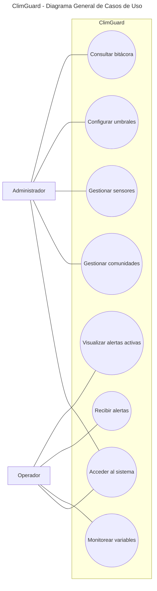

# ClimGuard
## Diagrama General de Casos de Uso

| Proyecto | ClimGuard |
|-----------|-----------|
| Documento | Diagrama General de Casos de Uso |
| Código | DOC-06 |
| Versión | 1.0 |
| Estado | Finalizado |

---

# Objetivo

El presente documento presenta el diagrama general de casos de uso implementados en ClimGuard, mostrando la interacción entre los actores del sistema y las funcionalidades disponibles para cada uno de ellos.

# Diagrama
