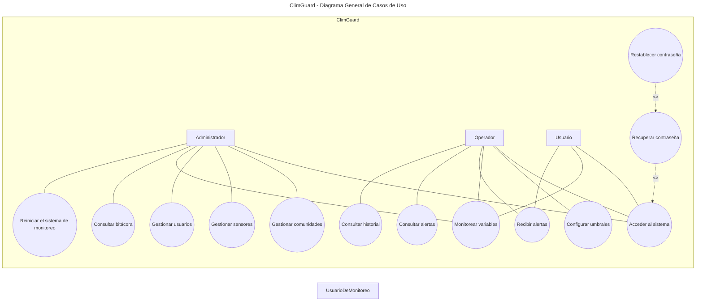

# ClimGuard
## Diagrama General de Casos de Uso

| Proyecto | ClimGuard |
|-----------|-----------|
| Documento | Diagrama General de Casos de Uso |
| Código | DOC-06 |
| Versión | 1.0 |
| Estado | En desarrollo |

---

# Objetivo

El presente documento representa gráficamente la interacción entre los actores del sistema ClimGuard y los casos de uso definidos durante el análisis funcional.

El diagrama permite visualizar las funcionalidades disponibles para cada actor, así como las relaciones existentes entre los diferentes casos de uso.

# Diagrama
