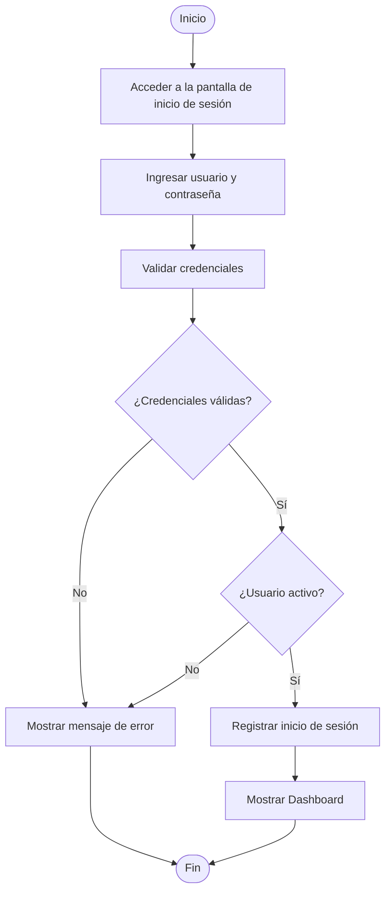
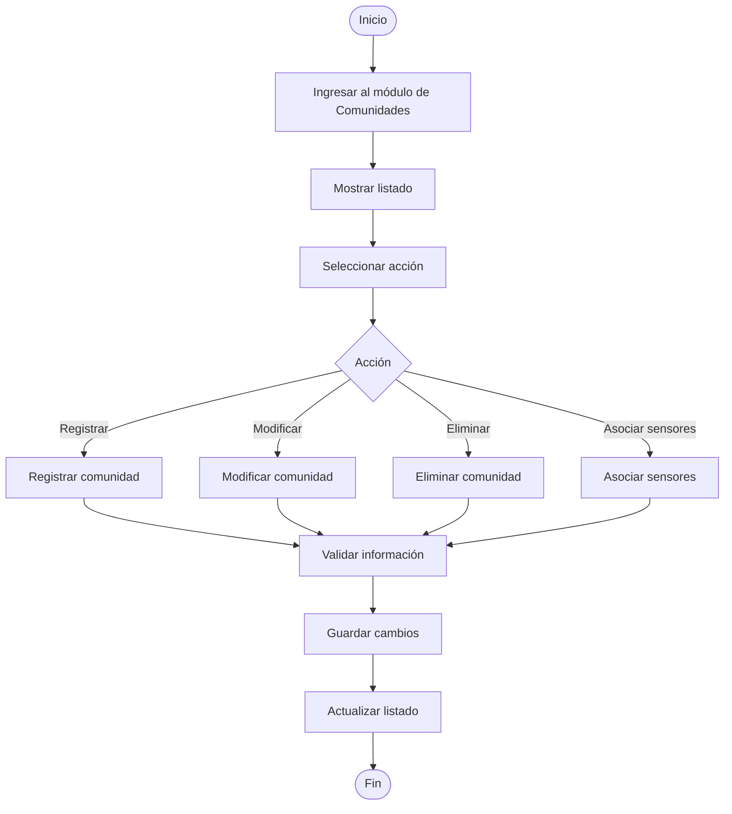
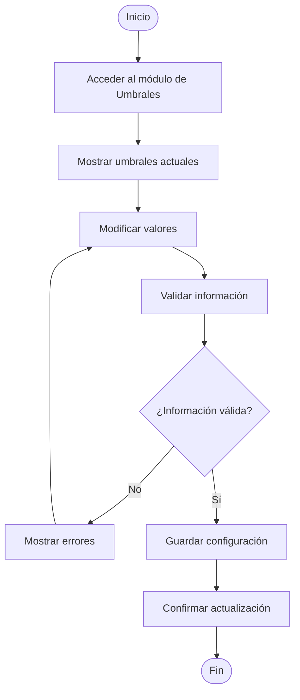
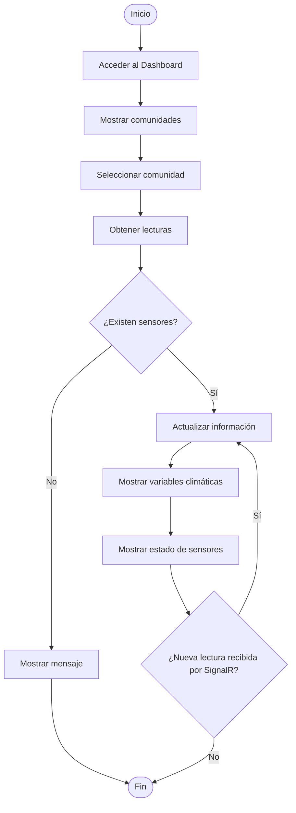
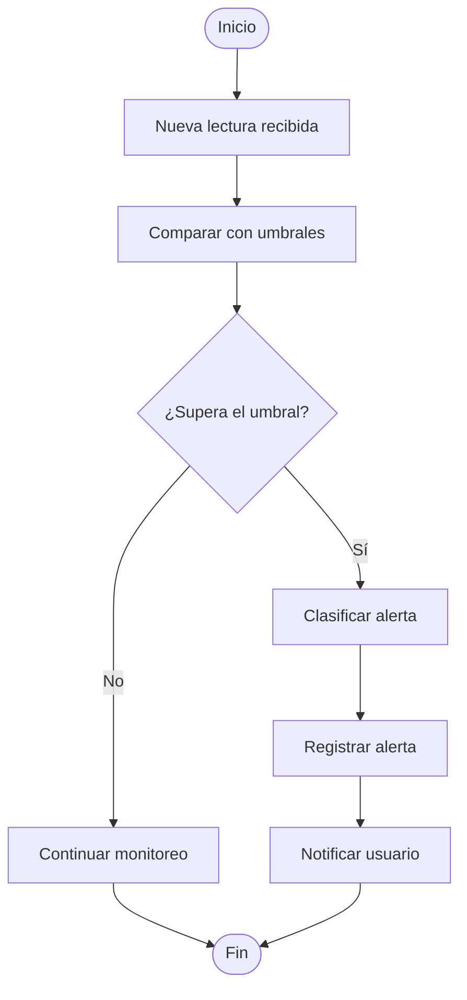
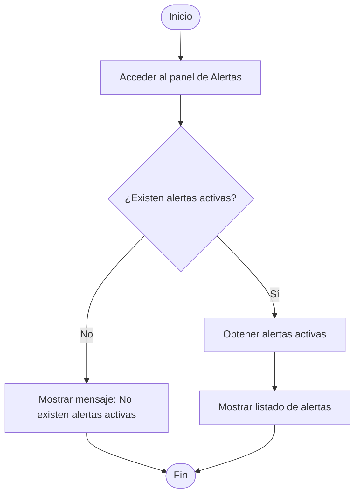
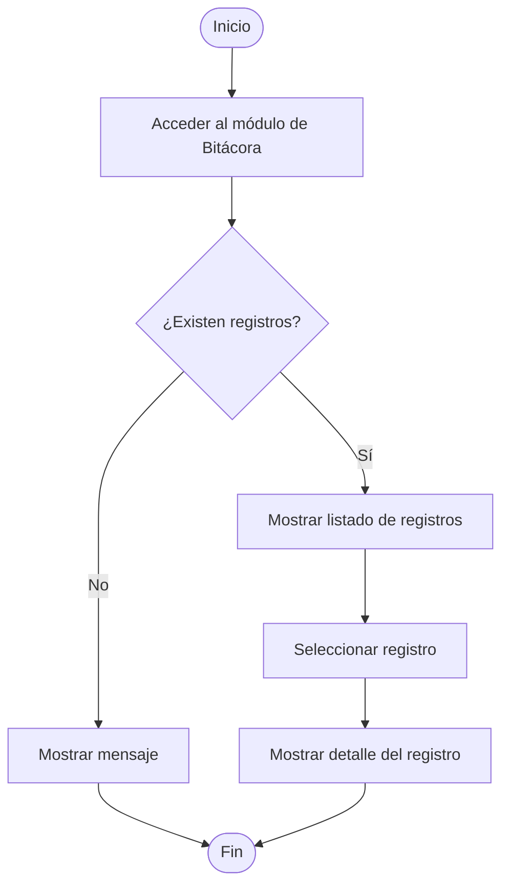

# ClimGuard
## Diagramas de Actividades

| Proyecto | ClimGuard |
|-----------|-----------|
| Documento | Diagramas de Actividades |
| Código | DOC-07 |
| Versión | 1.0 |
| Estado | Finalizado |

---

# Objetivo

El presente documento presenta los diagramas de actividades correspondientes a los casos de uso implementados en ClimGuard, mostrando el flujo de acciones, decisiones y resultados de los principales procesos del sistema.

# DA-001 – Acceder al sistema

# DA-002 - Gestionar comunidades 

# DA-003 - Gestionar sensores

# DA-004 - Configurar umbrales

# DA-005 - Monitorear variables climáticas

# DA-006 - Recibir alertas

# DA-007 – Visualizar alertas activas

# DA-008 - Consultar bitácora
