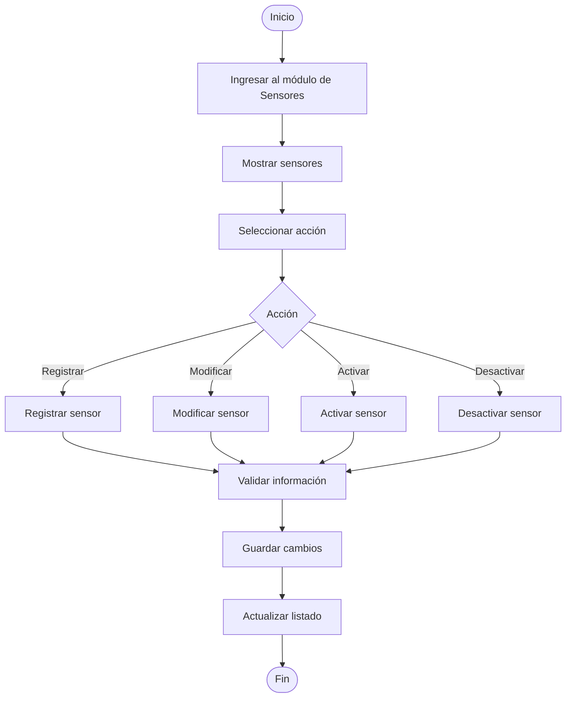
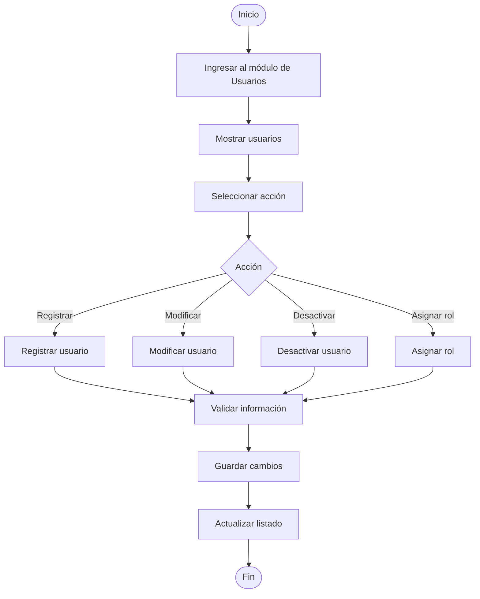
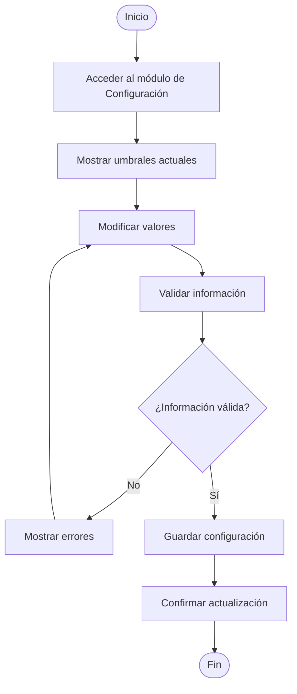
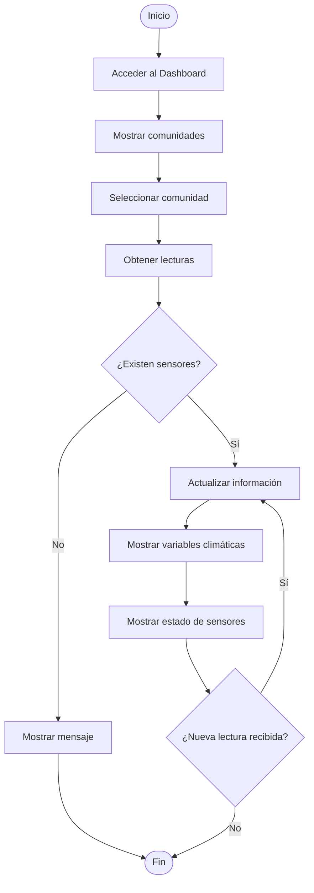
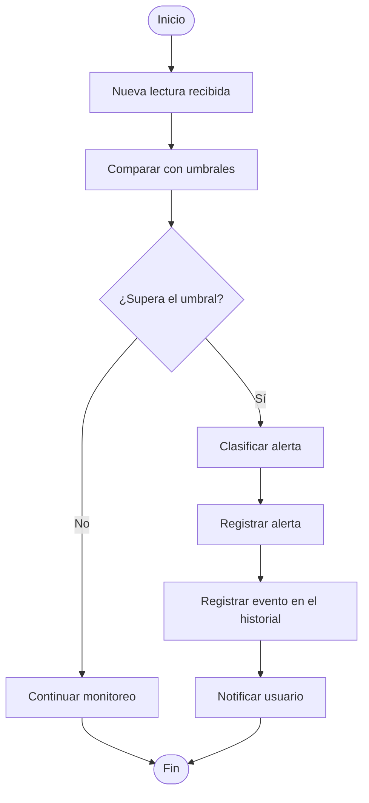
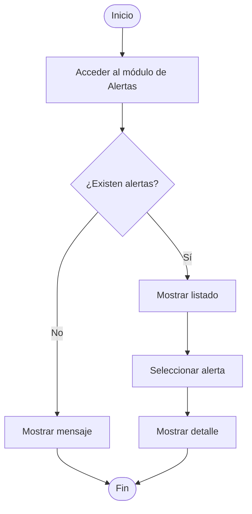
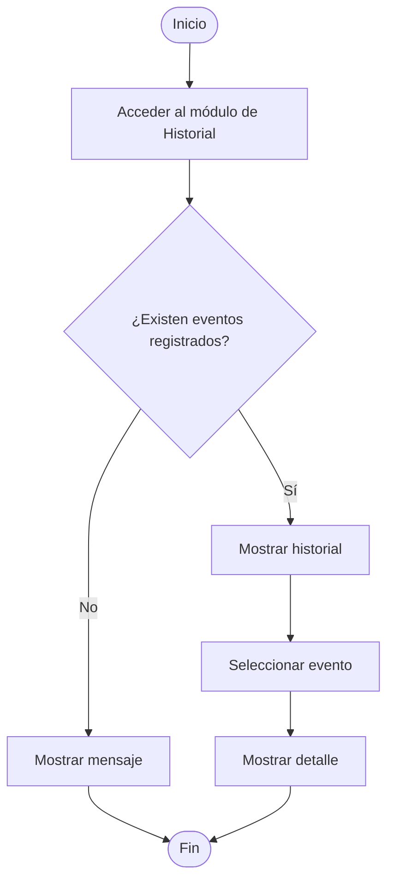
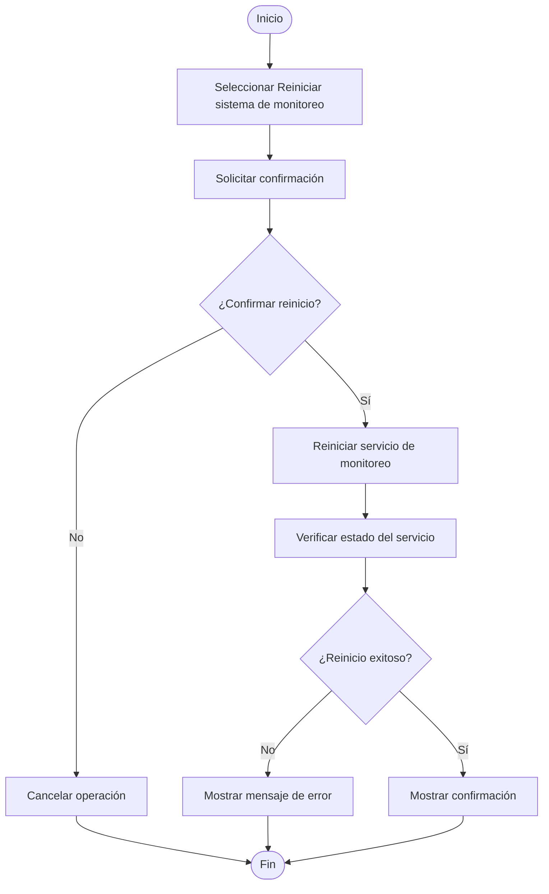
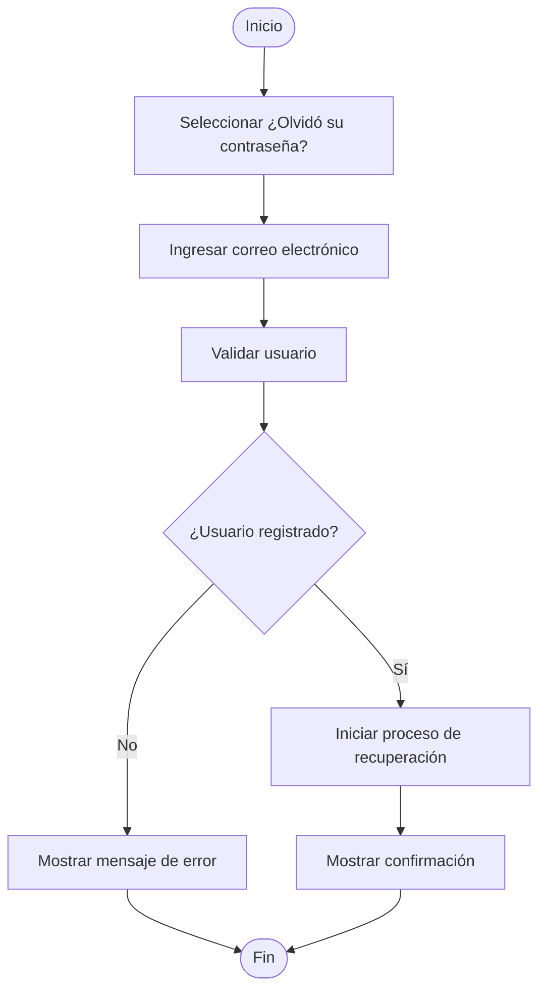
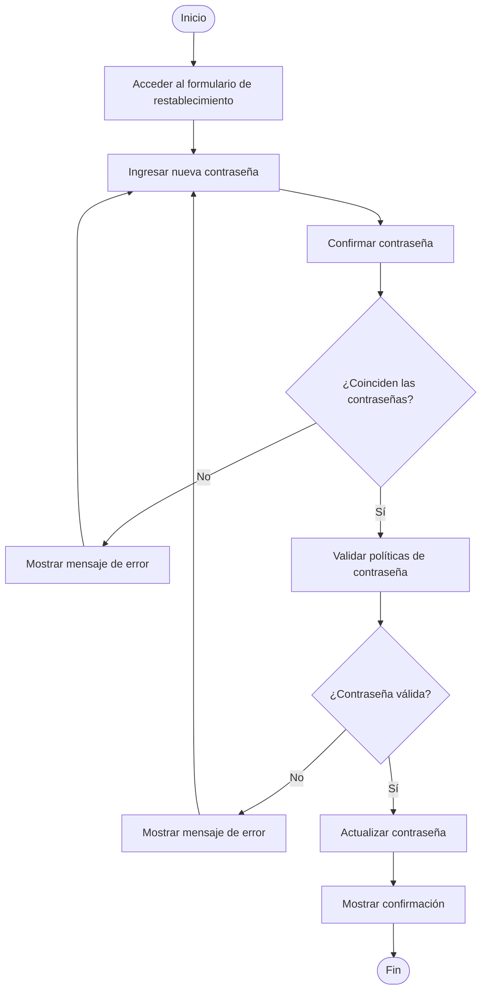

# ClimGuard
## Diagramas de Actividades

| Proyecto | ClimGuard |
|-----------|-----------|
| Documento | Diagramas de Actividades |
| Código | DOC-07 |
| Versión | 1.0 |
| Estado | En desarrollo |

---

# Objetivo

El presente documento describe gráficamente el flujo de actividades correspondiente a cada caso de uso del sistema ClimGuard, mostrando la secuencia lógica de acciones, decisiones y resultados para cada proceso.

# DA-001 – Acceder al sistema

# DA-002 - Gestionar comunidades 

# DA-003 - Gestionar sensores

# DA-004 - Gestionar usuarios

# DA-005 - Configurar umbrales

# DA-006 - Monitorear variables climáticas

# DA-007 - Recibir alertas

# DA-008 - Consultar Alertas

# DA-009 - Consultar historial

# DA-010 - Consultar bitácora

# DA-011 - Reiniciar el sistema de monitoreo

# DA-12 - Reiniciar contraseña

# DA-13 - Restablecer contraseña
