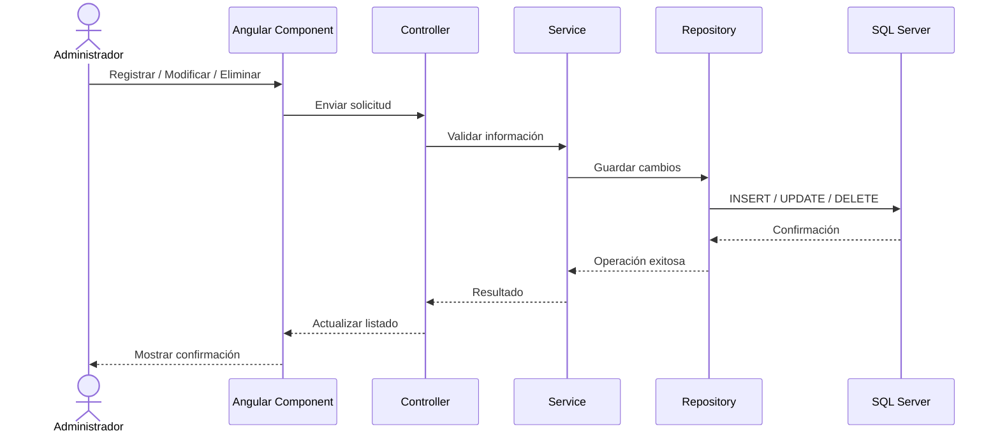
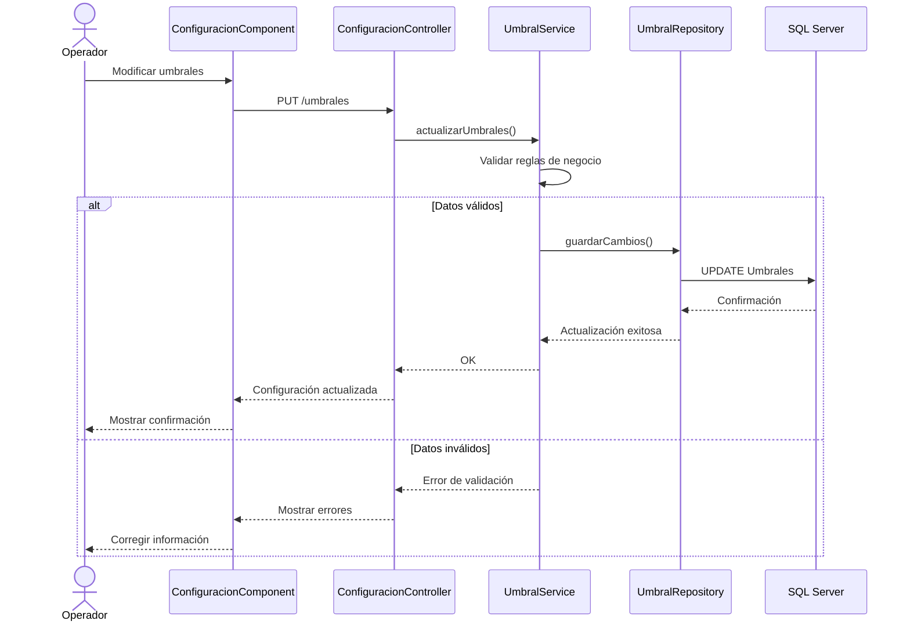
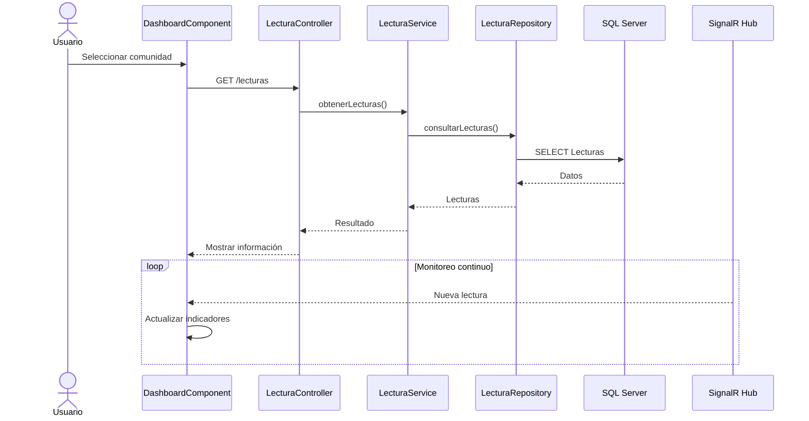
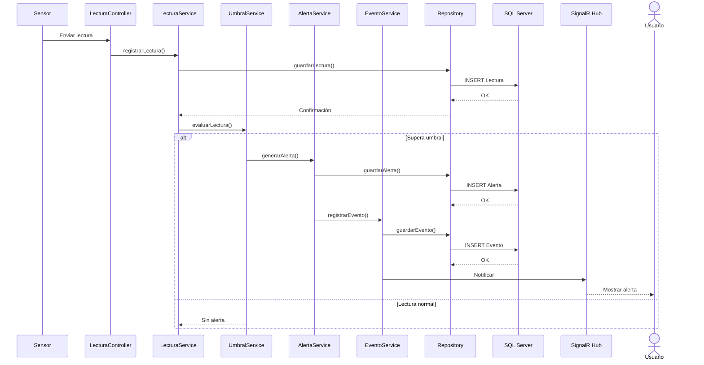
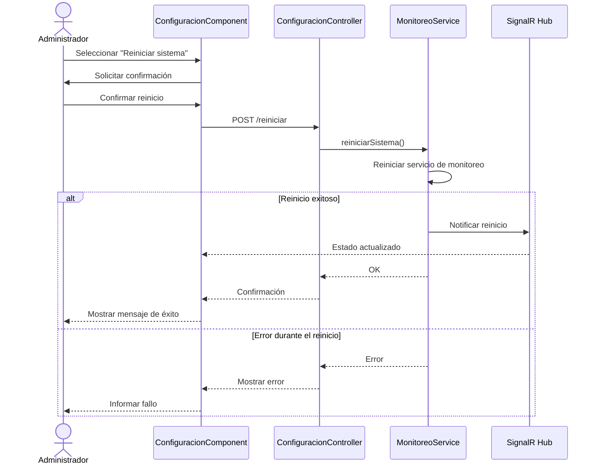
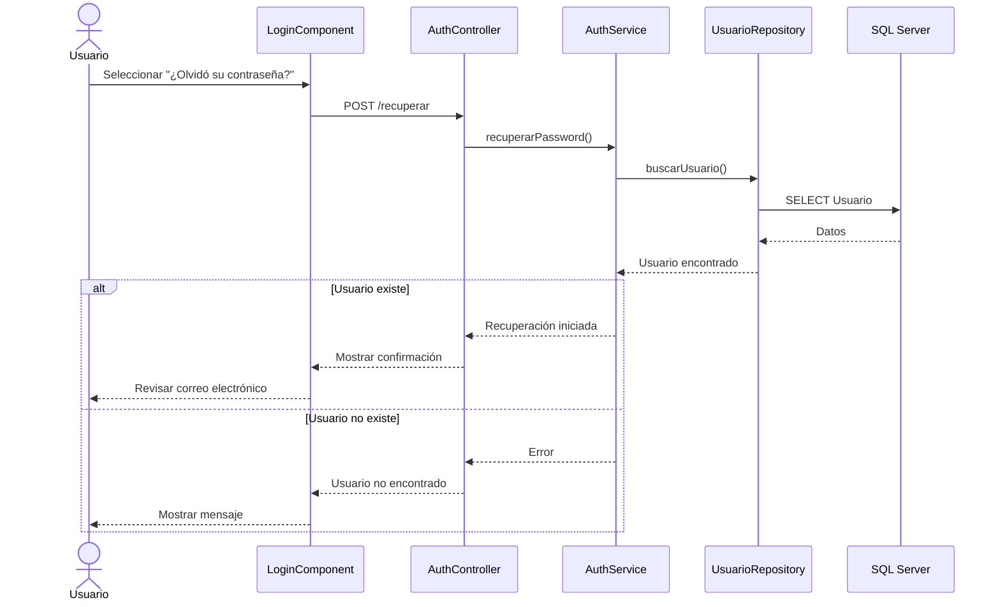
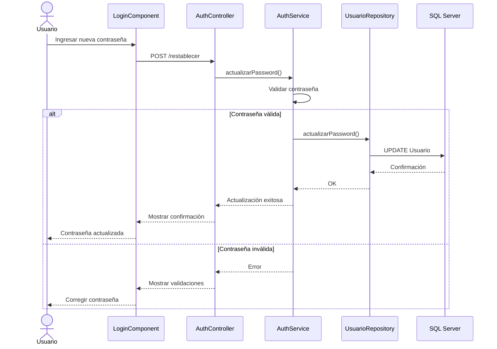

# ClimGuard
## Diagramas de Secuencia

| Proyecto | ClimGuard |
|-----------|-----------|
| Documento | Diagramas de Secuencia |
| Código | DOC-08 |
| Versión | 1.0 |
| Estado | En desarrollo |

---

# Objetivo

El presente documento representa la interacción dinámica entre los diferentes componentes del sistema ClimGuard durante la ejecución de los casos de uso principales.

Los diagramas muestran la secuencia de mensajes intercambiados entre actores, componentes del frontend, backend, servicios y base de datos.

# DS-001- Acceder al sistema

```mermaid
sequenceDiagram

actor Usuario

participant Login as LoginComponent
participant AuthController
participant AuthService
participant UsuarioRepository
participant SQL as SQL Server

Usuario->>Login: Ingresa usuario y contraseña

Login->>AuthController: POST /login

AuthController->>AuthService: autenticar()

AuthService->>UsuarioRepository: buscarUsuario()

UsuarioRepository->>SQL: Consultar usuario

SQL-->>UsuarioRepository: Datos del usuario

UsuarioRepository-->>AuthService: Usuario encontrado

AuthService->>AuthService: Validar contraseña

alt Credenciales válidas

    AuthService-->>AuthController: JWT + Rol

    AuthController-->>Login: Inicio de sesión exitoso

    Login-->>Usuario: Mostrar Dashboard

else Credenciales inválidas

    AuthService-->>AuthController: Error

    AuthController-->>Login: Credenciales incorrectas

    Login-->>Usuario: Mostrar mensaje

end
```

# DS-002- Gestión administrativa

# DS-003- Configurar umbrales

# DS-004- Monitorear variables climática

# DS-005- Recibir alertas

# DS-006- Reiniciar el sistema de monitoreo

# DS-007- Recuperar contraseña

# DS-008- Restablecer contraseña
