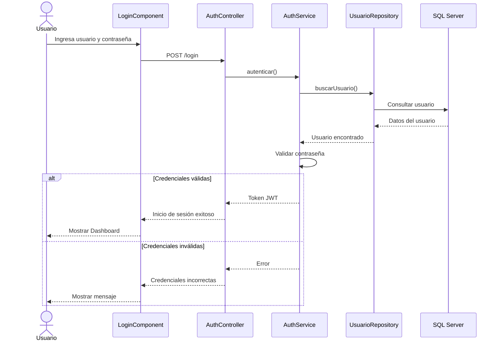
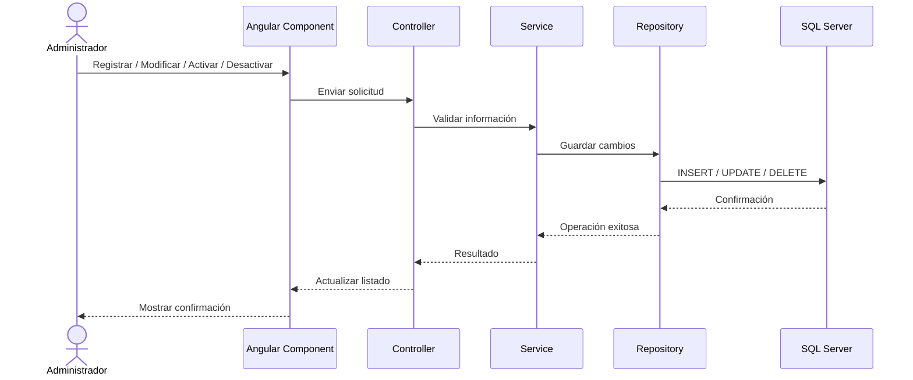
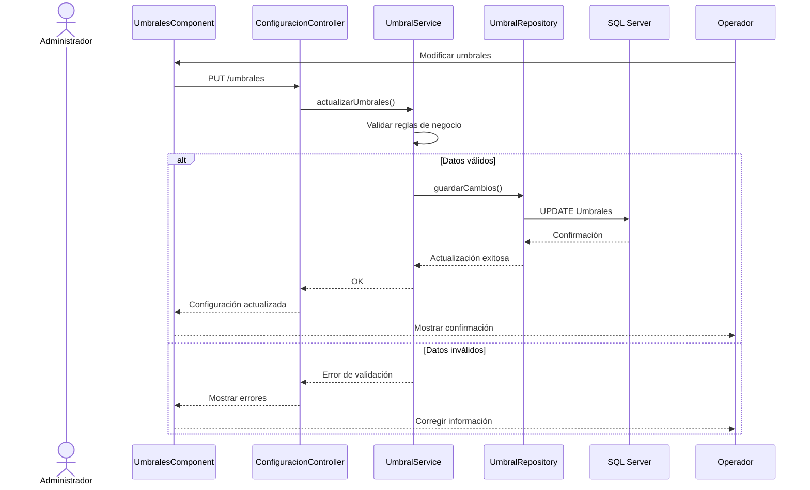
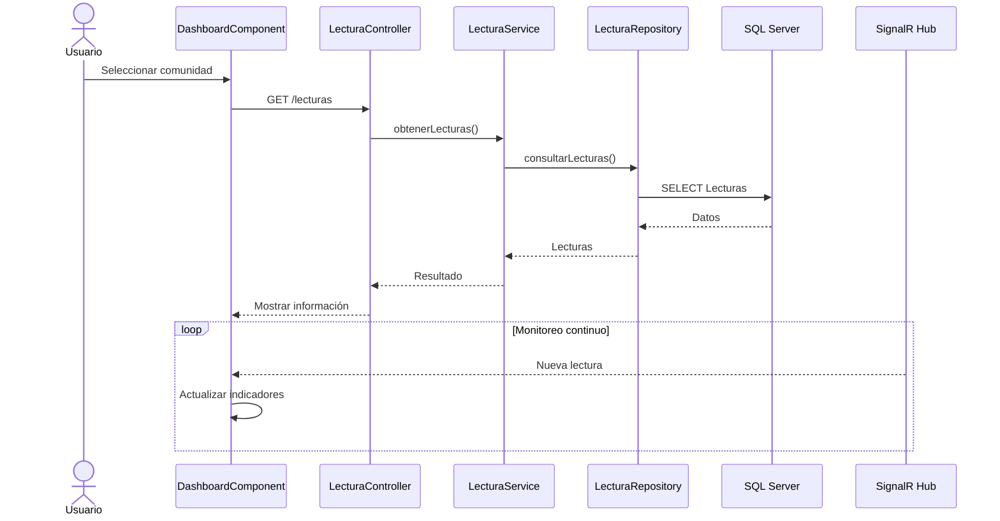
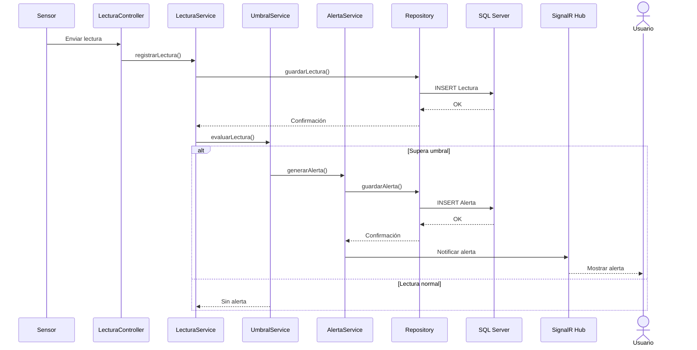
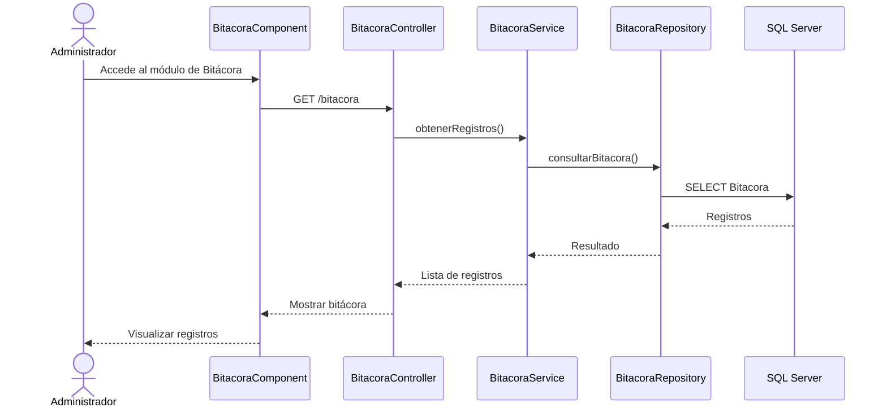

# ClimGuard
## Diagramas de Secuencia

| Proyecto | ClimGuard |
|-----------|-----------|
| Documento | Diagramas de Secuencia |
| Código | DOC-08 |
| Versión | 1.0 |
| Estado | Finalizado |

---

# Objetivo

El presente documento describe la secuencia de interacción entre los actores y los componentes del sistema ClimGuard durante la ejecución de los principales casos de uso implementados.

Cada diagrama muestra el intercambio de mensajes entre la interfaz web, la API REST, los servicios de negocio, el acceso a datos y la base de datos SQL Server.

# DS-001- Acceder al sistema

# DS-002- Administración de comunidades y sensores

# DS-003- Configurar umbrales

# DS-004- Monitorear variables climática

# DS-005 – Recibir alertas

# DS-006 - Consultar bitácora
