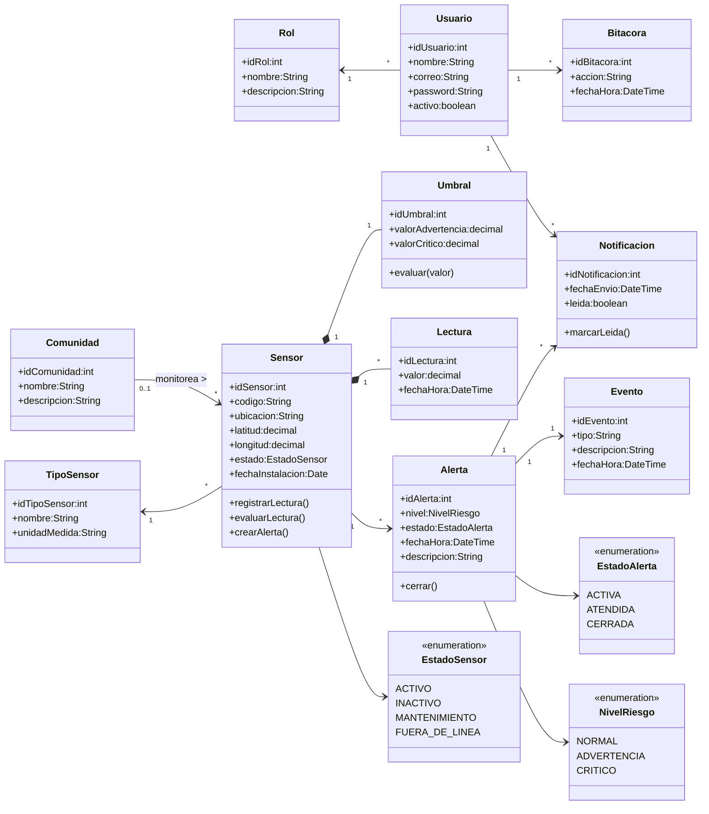

# ClimGuard
## Diagrama de Clases

| Proyecto | ClimGuard |
|-----------|-----------|
| Documento | Diagrama de Clases |
| Código | DOC-09 |
| Versión | 1.0 |
| Estado | En desarrollo |

---

# Objetivo

El presente documento describe el modelo de clases del dominio del sistema ClimGuard, identificando las entidades, catálogos, enumeraciones, atributos, métodos y relaciones que conforman la estructura orientada a objetos de la aplicación.

El diagrama de clases constituye la base para la implementación del sistema, permitiendo representar la organización del dominio y las responsabilidades de cada clase de acuerdo con los principios de orientación a objetos y las reglas de negocio definidas durante la etapa de análisis.

---

# Diagrama de Clases

---

# Observaciones

- El diagrama representa únicamente las clases pertenecientes al dominio del negocio.
- Los componentes de infraestructura (Controllers, Services, Repositories, SignalR y Base de Datos) no forman parte de este modelo, ya que corresponden a la arquitectura de software.
- La clase **Sensor** constituye la clase experta (GRASP Expert) del dominio, siendo responsable del registro de lecturas, evaluación de umbrales y creación de alertas.