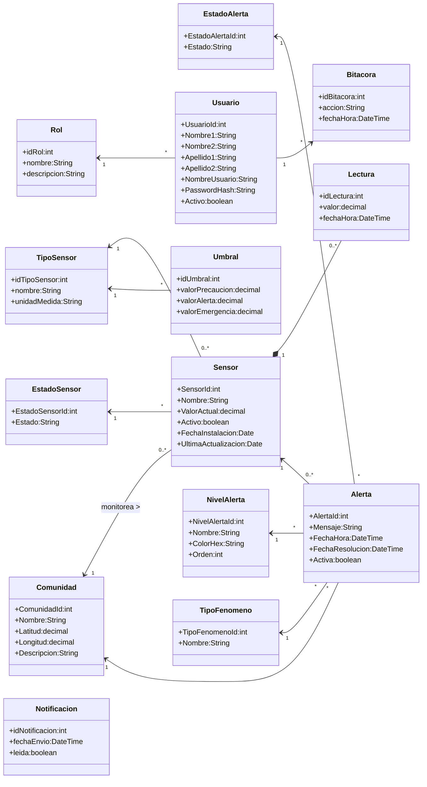

# ClimGuard
## Diagrama de Clases

| Proyecto | ClimGuard |
|-----------|-----------|
| Documento | Diagrama de Clases |
| Código | DOC-09 |
| Versión | 1.0 |
| Estado | Finalizado |

---

# Objetivo

El presente documento describe el modelo de clases del dominio del sistema ClimGuard, representando las principales entidades, catálogos, atributos y relaciones implementadas en la aplicación.

El diagrama constituye una vista conceptual del dominio y sirve como base para comprender la estructura de los datos y la interacción entre las entidades del sistema.

---

# Diagrama de Clases

---

# Observaciones

- El diagrama representa únicamente las clases pertenecientes al dominio del negocio.
- Los componentes de infraestructura (Controllers, Services, Repositories, SignalR y Base de Datos) no forman parte de este modelo, ya que corresponden a la arquitectura de software.
- Las entidades del dominio representan la información persistida por el sistema. La lógica de negocio asociada a la evaluación de lecturas, generación de alertas y notificaciones se implementa en la capa de servicios del backend.
- Los estados y catálogos del sistema (Rol, TipoSensor, EstadoSensor, EstadoAlerta, NivelAlerta y TipoFenomeno) se representan como clases debido a que son administrados mediante tablas de catálogo en la base de datos.