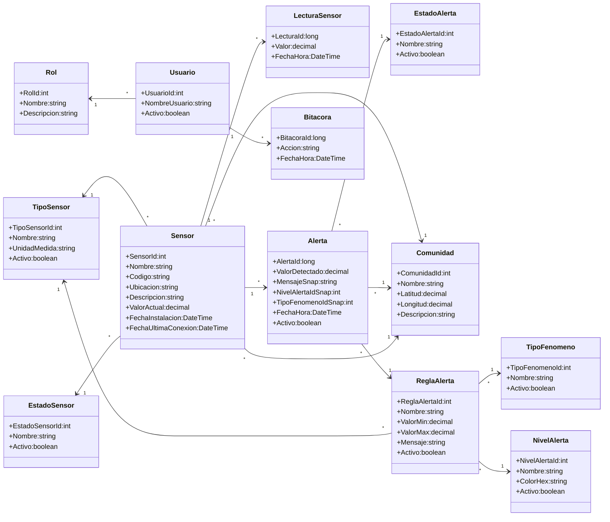

# ClimGuard
## Diagrama de Clases

| Proyecto | ClimGuard |
|-----------|-----------|
| Documento | Diagrama de Clases |
| Código | DOC-09 |
| Versión | 2.0 |
| Estado | Finalizado |

---

# Objetivo

El presente documento describe el modelo de clases implementado en la versión final de ClimGuard. El diagrama representa las entidades del dominio, catálogos y relaciones persistidas en la base de datos, permitiendo comprender la organización de la información utilizada por el sistema para el monitoreo climático, la simulación de lecturas, la generación de alertas y la administración de los diferentes módulos.

A diferencia de las versiones iniciales, el modelo incorpora la persistencia de lecturas históricas mediante la entidad **LecturaSensor** y el uso de **snapshots** dentro de las alertas, con el propósito de conservar la información que dio origen a cada evento aun cuando las reglas sean modificadas posteriormente.

---

# Diagrama de Clases

```mermaid
classDiagram
direction LR

%%========================
%% CATÁLOGOS
%%========================

class Rol{
    +RolId:int
    +Nombre:string
    +Descripcion:string
}

class TipoSensor{
    +TipoSensorId:int
    +Nombre:string
    +UnidadMedida:string
    +Activo:boolean
}

class EstadoSensor{
    +EstadoSensorId:int
    +Nombre:string
    +Activo:boolean
}

class EstadoAlerta{
    +EstadoAlertaId:int
    +Nombre:string
    +Activo:boolean
}

class NivelAlerta{
    +NivelAlertaId:int
    +Nombre:string
    +ColorHex:string
    +Activo:boolean
}

class TipoFenomeno{
    +TipoFenomenoId:int
    +Nombre:string
    +Activo:boolean
}

%%========================
%% ENTIDADES
%%========================

class Usuario{
    +UsuarioId:int
    +NombreUsuario:string
    +Activo:boolean
}

class Comunidad{
    +ComunidadId:int
    +Nombre:string
    +Latitud:decimal
    +Longitud:decimal
    +Descripcion:string
}

class Sensor{
    +SensorId:int
    +Nombre:string
    +Codigo:string
    +Ubicacion:string
    +Descripcion:string
    +ValorActual:decimal
    +FechaInstalacion:DateTime
    +FechaUltimaConexion:DateTime
}

class ReglaAlerta{
    +ReglaAlertaId:int
    +Nombre:string
    +ValorMin:decimal
    +ValorMax:decimal
    +Mensaje:string
    +Activo:boolean
}

class LecturaSensor{
    +LecturaId:long
    +Valor:decimal
    +FechaHora:DateTime
}

class Alerta{
    +AlertaId:long
    +ValorDetectado:decimal
    +MensajeSnap:string
    +NivelAlertaIdSnap:int
    +TipoFenomenoIdSnap:int
    +FechaHora:DateTime
    +Activo:boolean
}

class Bitacora{
    +BitacoraId:long
    +Accion:string
    +FechaHora:DateTime
}

%%========================
%% RELACIONES
%%========================

Rol "1" <-- "*" Usuario

Usuario "1" --> "*" Bitacora

Comunidad "1" <-- "*" Sensor

TipoSensor "1" <-- "*" Sensor

EstadoSensor "1" <-- "*" Sensor

Sensor "1" --> "*" LecturaSensor

Sensor "1" --> "*" Alerta

Sensor "*" --> "1" Comunidad

ReglaAlerta "*" --> "1" TipoSensor

ReglaAlerta "*" --> "1" TipoFenomeno

ReglaAlerta "*" --> "1" NivelAlerta

Alerta "*" --> "1" ReglaAlerta

Alerta "*" --> "1" EstadoAlerta

Alerta "*" --> "1" Comunidad
```

---

# Observaciones

- El modelo representa exclusivamente las entidades del dominio persistidas en la base de datos.
- La generación de lecturas es realizada automáticamente por un **Background Service**, el cual crea registros en **LecturaSensor** y actualiza el valor actual de cada sensor.
- La evaluación de reglas se realiza utilizando la entidad **ReglaAlerta**, sustituyendo el modelo anterior basado en umbrales independientes.
- La entidad **Alerta** almacena snapshots del mensaje, nivel de alerta y tipo de fenómeno (`MensajeSnap`, `NivelAlertaIdSnap` y `TipoFenomenoIdSnap`), garantizando la integridad histórica de cada alerta aun cuando las reglas sean modificadas posteriormente.
- Las entidades principales incorporan auditoría mediante los campos de usuario y fecha de creación/modificación.
- Los componentes de infraestructura (Controllers, Repositories, Background Services, SignalR, Docker y Base de Datos) no forman parte del modelo de clases, ya que pertenecen a la arquitectura de implementación.