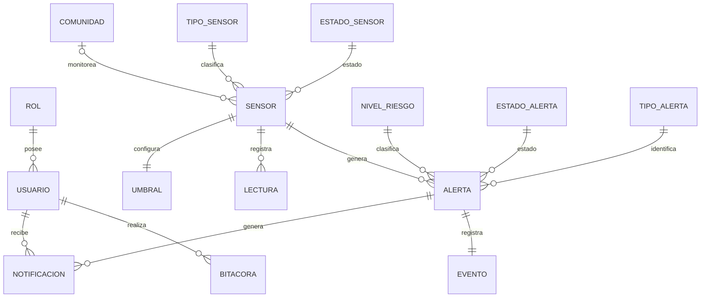

# ClimGuard
## Modelo de Base de Datos

| Proyecto | ClimGuard |
|-----------|-----------|
| Documento | Modelo de Base de Datos |
| Código | DOC-10 |
| Versión | 1.0 |
| Estado | En desarrollo |

---

# Objetivo

El presente documento describe el modelo de base de datos del sistema ClimGuard, derivado del diagrama de clases del dominio.

Su propósito es establecer la estructura relacional que permitirá almacenar la información administrada por el sistema, definiendo las entidades, catálogos, relaciones, claves primarias, claves foráneas y restricciones necesarias para garantizar la integridad de los datos.

El modelo servirá como base para la implementación de la base de datos en SQL Server 2022 y para la construcción de las entidades utilizadas por la API desarrollada en .NET.

---

# 1. Reglas de Transformación

Para construir el modelo relacional se aplicaron las siguientes reglas:

- Cada entidad del dominio se transforma en una tabla.
- Los catálogos se implementan como tablas independientes para facilitar la administración de sus valores.
- Las relaciones uno a muchos se implementan mediante claves foráneas.
- Las relaciones uno a uno se implementan mediante claves foráneas con restricción de unicidad.
- Todas las claves primarias utilizan **INT IDENTITY(1,1)**.
- Todas las claves foráneas utilizan **INT**.

---

# 2. Catálogos

El sistema utiliza las siguientes tablas catálogo.

| Tabla | Descripción |
|--------|-------------|
| Rol | Define los permisos asignados a cada usuario. |
| TipoSensor | Clasifica los sensores según la variable climática monitoreada. |
| EstadoSensor | Indica el estado operativo de un sensor. |
| NivelRiesgo | Clasifica el nivel de gravedad de una alerta. |
| EstadoAlerta | Representa el estado actual de una alerta. |
| TipoAlerta | Clasifica el fenómeno climático detectado. |

---

# 3. Entidades

El sistema está compuesto por las siguientes entidades principales.

| Tabla | Descripción |
|--------|-------------|
| Usuario | Usuarios registrados del sistema. |
| Comunidad | Comunidades monitoreadas por ClimGuard. |
| Sensor | Dispositivos encargados del monitoreo climático. |
| Umbral | Configuración de límites asociados a un sensor. |
| Lectura | Mediciones registradas por un sensor. |
| Alerta | Riesgos detectados automáticamente por el sistema. |
| Notificacion | Notificaciones enviadas a los usuarios. |
| Evento | Historial de eventos importantes del sistema. |
| Bitacora | Registro de acciones realizadas por los usuarios. |

---

# 4. Modelo Entidad Relación

---

# 5. Modelo Relacional

## Rol

| Campo | Tipo | PK | FK | Nulo |
|--------|------|:--:|:--:|:----:|
| idRol | INT | Sí |-| No |
| nombre | VARCHAR(50) |-|-| No |
| descripcion | VARCHAR(200) |-|-| Sí |

---

## Usuario

| Campo | Tipo | PK | FK | Nulo |
|--------|------|:--:|:--:|:----:|
| idUsuario | INT | Sí |-| No |
| idRol | INT |-| Sí | No |
| nombre | VARCHAR(100) |-|-| No |
| correo | VARCHAR(100) |-|-| No |
| password | VARCHAR(255) |-|-| No |
| activo | BIT |-|-| No |

---

## Comunidad

| Campo | Tipo | PK | FK | Nulo |
|--------|------|:--:|:--:|:----:|
| idComunidad | INT | Sí |-| No |
| nombre | VARCHAR(100) |-|-| No |
| descripcion | VARCHAR(250) |-|-| Sí |

---

## TipoSensor

| Campo | Tipo | PK | FK | Nulo |
|--------|------|:--:|:--:|:----:|
| idTipoSensor | INT | Sí |-| No |
| nombre | VARCHAR(50) |-|-| No |
| unidadMedida | VARCHAR(20) |-|-| No |

---

## EstadoSensor

| Campo | Tipo | PK | FK | Nulo |
|--------|------|:--:|:--:|:----:|
| idEstadoSensor | INT | Sí |-| No |
| nombre | VARCHAR(50) |-|-| No |

---

## Sensor

| Campo | Tipo | PK | FK | Nulo |
|--------|------|:--:|:--:|:----:|
| idSensor | INT | Sí |-| No |
| idComunidad | INT |-| Sí | Sí |
| idTipoSensor | INT |-| Sí | No |
| idEstadoSensor | INT |-| Sí | No |
| codigo | VARCHAR(50) |-|-| No |
| ubicacion | VARCHAR(100) |-|-| No |
| latitud | DECIMAL(9,6) |-|-| No |
| longitud | DECIMAL(9,6) |-|-| No |
| fechaInstalacion | DATETIME2 |-|-| No |

---

## Umbral

| Campo | Tipo | PK | FK | Nulo |
|--------|------|:--:|:--:|:----:|
| idUmbral | INT | Sí |-| No |
| idSensor | INT |-| Sí | No |
| valorAdvertencia | DECIMAL(10,2) |-|-| No |
| valorCritico | DECIMAL(10,2) |-|-| No |

---

## Lectura

| Campo | Tipo | PK | FK | Nulo |
|--------|------|:--:|:--:|:----:|
| idLectura | INT | Sí |-| No |
| idSensor | INT |-| Sí | No |
| valor | DECIMAL(10,2) |-|-| No |
| fechaHora | DATETIME2 |-|-| No |

---

## NivelRiesgo

| Campo | Tipo | PK | FK | Nulo |
|--------|------|:--:|:--:|:----:|
| idNivelRiesgo | INT | Sí |-| No |
| nombre | VARCHAR(50) |-|-| No |

---

## EstadoAlerta

| Campo | Tipo | PK | FK | Nulo |
|--------|------|:--:|:--:|:----:|
| idEstadoAlerta | INT | Sí |-| No |
| nombre | VARCHAR(50) |-|-| No |

---

## TipoAlerta

| Campo | Tipo | PK | FK | Nulo |
|--------|------|:--:|:--:|:----:|
| idTipoAlerta | INT | Sí |-| No |
| nombre | VARCHAR(100) |-|-| No |
| descripcion | VARCHAR(250) |-|-| Sí |

---

## Alerta

| Campo | Tipo | PK | FK | Nulo |
|--------|------|:--:|:--:|:----:|
| idAlerta | INT | Sí |-| No |
| idSensor | INT |-| Sí | No |
| idNivelRiesgo | INT |-| Sí | No |
| idEstadoAlerta | INT |-| Sí | No |
| idTipoAlerta | INT |-| Sí | No |
| descripcion | VARCHAR(250) |-|-| No |
| fechaHora | DATETIME2 |-|-| No |

---

## Notificacion

| Campo | Tipo | PK | FK | Nulo |
|--------|------|:--:|:--:|:----:|
| idNotificacion | INT | Sí |-| No |
| idUsuario | INT |-| Sí | No |
| idAlerta | INT |-| Sí | No |
| fechaEnvio | DATETIME2 |-|-| No |
| leida | BIT |-|-| No |

---

## Evento

| Campo | Tipo | PK | FK | Nulo |
|--------|------|:--:|:--:|:----:|
| idEvento | INT | Sí |-| No |
| idAlerta | INT |-| Sí | No |
| tipo | VARCHAR(100) |-|-| No |
| descripcion | VARCHAR(250) |-|-| No |
| fechaHora | DATETIME2 |-|-| No |

---

## Bitacora

| Campo | Tipo | PK | FK | Nulo |
|--------|------|:--:|:--:|:----:|
| idBitacora | INT | Sí |-| No |
| idUsuario | INT |-| Sí | No |
| accion | VARCHAR(150) |-|-| No |
| fechaHora | DATETIME2 |-|-| No |

---

# 6. Restricciones

- El correo electrónico del usuario debe ser único.
- El código del sensor debe ser único.
- Un sensor podrá registrarse sin estar asignado inicialmente a una comunidad.
- Una lectura siempre debe pertenecer a un sensor.
- Un umbral siempre pertenece a un único sensor.
- Una alerta siempre debe estar asociada a un sensor.
- Una notificación siempre corresponde a una alerta y a un usuario.
- Un evento registra la ocurrencia de una alerta.
- Los registros de los catálogos deberán existir previamente antes de ser utilizados como claves foráneas.