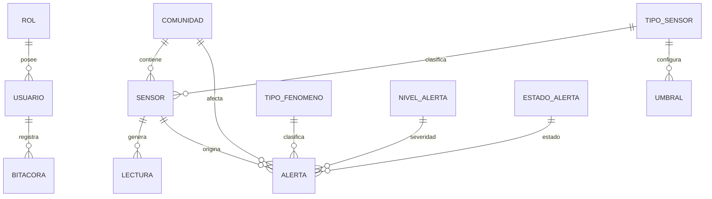

# ClimGuard
## Modelo de Base de Datos

| Proyecto | ClimGuard |
|-----------|-----------|
| Documento | Modelo de Base de Datos |
| Código | DOC-10 |
| Versión | 1.0 |
| Estado | Finalizado |

---

# Objetivo

El presente documento describe el modelo de base de datos del sistema ClimGuard, derivado del diagrama de clases del dominio.

Su propósito es establecer la estructura relacional que permitirá almacenar la información administrada por el sistema, definiendo las entidades, catálogos, relaciones, claves primarias, claves foráneas y restricciones necesarias para garantizar la integridad de los datos.

El modelo servirá como base para la implementación de la base de datos en SQL Server 2022 y para la construcción de las entidades utilizadas por la API desarrollada en .NET.

---

# 1. Reglas de Transformación

Para construir el modelo relacional se aplicaron las siguientes reglas:

- Cada entidad del dominio se transforma en una tabla.
- Los catálogos se implementan como tablas independientes para facilitar la administración de sus valores.
- Las relaciones uno a muchos se implementan mediante claves foráneas.
- Todas las claves primarias utilizan **INT IDENTITY(1,1)**.
- Todas las claves foráneas utilizan **INT**.

---

# 2. Catálogos

El sistema utiliza las siguientes tablas catálogo.

| Tabla | Descripción |
|--------|-------------|
| Rol | Define los permisos asignados a cada usuario. |
| TipoSensor | Clasifica los sensores según la variable climática monitoreada. |
| NivelAlerta | Define los niveles de severidad de las alertas. |
| TipoFenomeno | Clasifica el fenómeno climático asociado a una alerta. |
| EstadoSensor | Define los estados operativos de un sensor. |
| EstadoAlerta | Define el estado de una alerta. |

---

# 3. Entidades

El sistema está compuesto por las siguientes entidades principales.

| Tabla | Descripción |
|--------|-------------|
| Usuario | Usuarios registrados del sistema. |
| Comunidad | Comunidades monitoreadas por ClimGuard. |
| Sensor | Dispositivos encargados del monitoreo climático. |
| Umbral | Configuración de límites asociados a un sensor. |
| Lectura | Mediciones registradas por un sensor. |
| Alerta | Riesgos detectados automáticamente por el sistema. |
| Notificacion | Notificaciones enviadas a los usuarios. |
| Bitacora | Registro de acciones realizadas por los usuarios. |

---

# 4. Modelo Entidad Relación

---

# 5. Modelo Relacional
Las relaciones entre las tablas se implementan mediante claves foráneas, conforme al modelo entidad-relación presentado anteriormente.

La definición completa de las tablas, columnas, tipos de datos, restricciones e índices se encuentra implementada en el script **QueryMain.sql**, el cual constituye la especificación técnica definitiva de la base de datos utilizada por el sistema.
---

# 6. Restricciones

- El correo electrónico del usuario debe ser único.
- El código del sensor debe ser único.
- Un sensor podrá registrarse sin estar asignado inicialmente a una comunidad.
- Una lectura siempre debe pertenecer a un sensor.
- Un umbral siempre pertenece a un único sensor.
- Una alerta siempre debe estar asociada a un sensor.
- Una notificación siempre corresponde a una alerta y a un usuario.
- Un evento registra la ocurrencia de una alerta.
- Los registros de los catálogos deberán existir previamente antes de ser utilizados como claves foráneas.

# 7. Observaciones
- Los registros inicial del catálogo NivelRiesgo serán:
    1. NORMAL (VERDE)
    2. PRECAUCIÓN (AMARILLO)
    3. ALERTA (NARANJA)
    4. EMERGENCIA (ROJO)

# 8. Índices recomendados
- IX_Lectura_Sensor_Fecha (idSensor, fechaHora)

# 9. Consideraciones de Implementación

- Los catálogos se implementan como tablas independientes para facilitar su mantenimiento y permitir la modificación de sus valores sin alterar la estructura del sistema.
- Los niveles de riesgo se calcularán automáticamente comparando el valor 