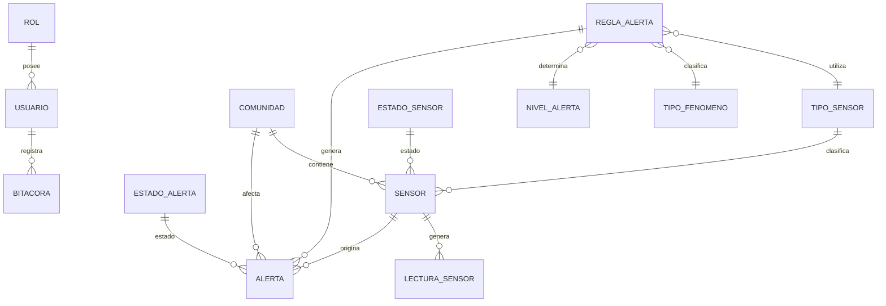

# ClimGuard
## Modelo de Base de Datos

| Proyecto | ClimGuard |
|-----------|-----------|
| Documento | Modelo de Base de Datos |
| Código | DOC-10 |
| Versión | 2.0 |
| Estado | Finalizado |

---

# Objetivo

El presente documento describe el modelo relacional implementado para el sistema ClimGuard. El modelo representa la estructura definitiva de la base de datos utilizada por la aplicación, incluyendo entidades, catálogos, relaciones, restricciones e índices implementados en SQL Server 2022.

El diseño fue construido para soportar el monitoreo climático, la simulación automática de lecturas, la generación de alertas y el almacenamiento histórico de la información, garantizando la integridad referencial y la trazabilidad de los datos mediante auditoría.

---

# 1. Reglas de Transformación

Para la construcción del modelo relacional se aplicaron las siguientes reglas:

- Cada entidad del dominio se implementa como una tabla.
- Los catálogos se almacenan en tablas independientes para facilitar su administración.
- Las relaciones uno a muchos se implementan mediante claves foráneas.
- Todas las claves primarias utilizan **INT IDENTITY(1,1)**, excepto **LecturaSensor** y **Alerta**, que utilizan **BIGINT IDENTITY** debido al volumen esperado de registros.
- Las entidades principales incorporan campos de auditoría (`UsuarioIng`, `FechaIng`, `UsuarioAct`, `FechaAct`).

---

# 2. Catálogos

El sistema utiliza las siguientes tablas catálogo.

| Tabla | Descripción |
|--------|-------------|
| Rol | Define los permisos asignados a cada usuario. |
| TipoSensor | Clasifica los sensores según la variable climática monitoreada. |
| EstadoSensor | Define el estado operativo de un sensor. |
| EstadoAlerta | Define el estado de una alerta. |
| NivelAlerta | Define el nivel de severidad utilizado por las reglas. |
| TipoFenomeno | Clasifica el fenómeno climático asociado a una regla de alerta. |

---

# 3. Entidades

El sistema está compuesto por las siguientes entidades principales.

| Tabla | Descripción |
|--------|-------------|
| Usuario | Usuarios registrados en el sistema. |
| Comunidad | Comunidades monitoreadas. |
| Sensor | Dispositivos encargados de registrar variables climáticas. |
| ReglaAlerta | Define los rangos de operación y la acción que debe ejecutarse cuando una lectura cumple la condición establecida. |
| LecturaSensor | Almacena el historial completo de lecturas generadas por cada sensor. |
| Alerta | Registra las alertas generadas automáticamente por el sistema utilizando snapshots de la regla aplicada. |
| Bitacora | Registro de acciones realizadas por los usuarios. |

---

# 4. Modelo Entidad Relación

```mermaid
erDiagram

ROL ||--o{ USUARIO : posee

COMUNIDAD ||--o{ SENSOR : contiene

TIPO_SENSOR ||--o{ SENSOR : clasifica

ESTADO_SENSOR ||--o{ SENSOR : estado

SENSOR ||--o{ LECTURA_SENSOR : genera

SENSOR ||--o{ ALERTA : origina

COMUNIDAD ||--o{ ALERTA : afecta

REGLA_ALERTA }o--|| TIPO_SENSOR : utiliza

REGLA_ALERTA }o--|| TIPO_FENOMENO : clasifica

REGLA_ALERTA }o--|| NIVEL_ALERTA : determina

REGLA_ALERTA ||--o{ ALERTA : genera

ESTADO_ALERTA ||--o{ ALERTA : estado

USUARIO ||--o{ BITACORA : registra
```

---

# 5. Modelo Relacional

El modelo relacional implementa las relaciones mediante claves foráneas y restricciones de integridad referencial.

Las entidades **Sensor**, **LecturaSensor**, **ReglaAlerta** y **Alerta** constituyen el núcleo funcional del sistema:

- Cada sensor pertenece a una comunidad y a un tipo de sensor.
- Un sensor puede generar múltiples lecturas históricas.
- Cada regla de alerta se asocia a un tipo de sensor, un nivel de alerta y un tipo de fenómeno.
- Una alerta conserva un snapshot del mensaje, nivel de alerta y fenómeno vigente al momento de su generación, permitiendo preservar la evidencia histórica aunque posteriormente las reglas sean modificadas.

La definición completa de tablas, restricciones, índices y relaciones se encuentra implementada en el script **QueryMain_P2.sql**, el cual constituye la especificación técnica definitiva de la base de datos.

---

# 6. Restricciones

- El nombre de usuario es único.
- El código del sensor es único.
- Todo sensor debe pertenecer a una comunidad existente.
- Todo sensor debe pertenecer a un tipo de sensor existente.
- Toda lectura pertenece obligatoriamente a un sensor.
- Toda regla pertenece a un tipo de sensor, un nivel de alerta y un tipo de fenómeno.
- Toda alerta pertenece a un sensor, una comunidad, una regla de alerta y un estado de alerta.
- Los snapshots almacenados en la tabla **Alerta** preservan la información utilizada durante la generación de la alerta.
- Los registros de los catálogos deben existir previamente antes de ser utilizados como claves foráneas.

---

# 7. Observaciones

Los niveles de alerta administrados por el sistema son:

1. Normal (Verde)
2. Precaución (Amarillo)
3. Alerta (Naranja)
4. Emergencia (Rojo)

Las alertas se generan automáticamente mediante un **Background Service**, el cual procesa las lecturas simuladas, evalúa las reglas configuradas y registra el evento correspondiente.

---

# 8. Índices recomendados

- IX_LecturaSensor_Sensor_Fecha (SensorId, FechaHora)
- IX_Alerta_Sensor_Fecha (SensorId, FechaHora)
- IX_ReglaAlerta_TipoSensor (TipoSensorId)

---

# 9. Consideraciones de Implementación

- La simulación de sensores genera registros históricos en **LecturaSensor**.
- El valor actual del sensor se mantiene sincronizado con la última lectura registrada.
- Las reglas de alerta son parametrizables y pueden modificarse sin afectar las alertas históricas gracias al uso de snapshots.
- El modelo incorpora auditoría para las entidades principales mediante usuario y fecha de creación/modificación.
- Todas las relaciones implementan integridad referencial mediante claves foráneas en SQL Server 2022.