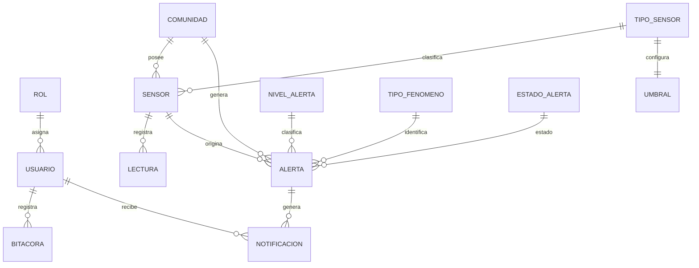

# ClimGuard
## Diagrama Entidad-Relación

| Proyecto | ClimGuard |
|-----------|-----------|
| Documento | Diagrama Entidad-Relación |
| Código | DOC-11 |
| Versión | 1.0 |
| Estado | Finalizado |

---

# Objetivo

El presente documento representa el modelo entidad-relación (DER) del sistema ClimGuard.

El diagrama muestra las entidades principales, los catálogos y las relaciones existentes entre ellas, constituyendo la base para la implementación de la base de datos en SQL Server 2022.

---

# Diagrama Entidad-Relación

---

# Descripción de las entidades

| Entidad | Descripción |
|----------|-------------|
| Usuario | Usuarios autorizados para acceder al sistema. |
| Rol | Catálogo de roles disponibles. |
| Comunidad | Comunidades monitoreadas por el sistema. |
| Sensor | Dispositivos encargados de obtener las variables climáticas. |
| TipoSensor | Catálogo de tipos de sensores. |
| Umbral | Valores límite asociados a cada tipo de sensor. |
| Lectura | Registros históricos generados por los sensores. |
| Alerta | Alertas generadas automáticamente cuando un umbral es superado. |
| NivelAlerta | Clasificación de severidad de una alerta. |
| TipoFenomeno | Catálogo de fenómenos climáticos monitoreados. |
| EstadoAlerta | Estado actual de una alerta. |
| Bitacora | Registro de acciones realizadas por los usuarios. |
| Notificacion | Notificaciones emitidas por el sistema hacia los usuarios. |

---

# Reglas del Modelo

- Un usuario pertenece a un único rol.
- Una comunidad puede tener múltiples sensores.
- Un sensor pertenece a un único tipo de sensor.
- Cada tipo de sensor posee una configuración de umbral.
- Un sensor registra múltiples lecturas.
- Una lectura puede originar una alerta.
- Cada alerta pertenece a una comunidad, un sensor, un nivel de alerta y un tipo de fenómeno.
- Los usuarios reciben notificaciones relacionadas con las alertas generadas.
- Todas las acciones administrativas quedan registradas en la bitácora.

---

# Observaciones

- El modelo representa la estructura lógica de la base de datos implementada en SQL Server.
- Los catálogos se modelan como tablas independientes para facilitar su administración.
- La información del sistema está normalizada para evitar redundancia y garantizar la integridad referencial.