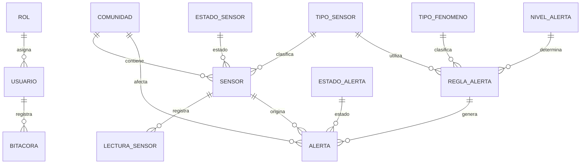

# ClimGuard
## Diagrama Entidad-Relación

| Proyecto | ClimGuard |
|-----------|-----------|
| Documento | Diagrama Entidad-Relación |
| Código | DOC-11 |
| Versión | 2.0 |
| Estado | Finalizado |

---

# Objetivo

El presente documento representa el Diagrama Entidad-Relación (DER) implementado para el sistema ClimGuard.

El modelo describe las entidades persistidas en la base de datos, los catálogos utilizados por la aplicación y las relaciones existentes entre ellas, constituyendo la base para la implementación del sistema en SQL Server 2022.

La versión final incorpora el almacenamiento histórico de lecturas mediante la entidad **LecturaSensor** y la parametrización de alertas mediante **ReglaAlerta**, sustituyendo el esquema inicial basado en umbrales.

---

# Diagrama Entidad-Relación

```mermaid
erDiagram

ROL ||--o{ USUARIO : asigna

COMUNIDAD ||--o{ SENSOR : contiene

TIPO_SENSOR ||--o{ SENSOR : clasifica

ESTADO_SENSOR ||--o{ SENSOR : estado

SENSOR ||--o{ LECTURA_SENSOR : registra

SENSOR ||--o{ ALERTA : origina

COMUNIDAD ||--o{ ALERTA : afecta

TIPO_SENSOR ||--o{ REGLA_ALERTA : utiliza

TIPO_FENOMENO ||--o{ REGLA_ALERTA : clasifica

NIVEL_ALERTA ||--o{ REGLA_ALERTA : determina

REGLA_ALERTA ||--o{ ALERTA : genera

ESTADO_ALERTA ||--o{ ALERTA : estado

USUARIO ||--o{ BITACORA : registra
```

---

# Descripción de las entidades

| Entidad | Descripción |
|----------|-------------|
| Usuario | Usuarios autorizados para acceder al sistema. |
| Rol | Catálogo de roles del sistema. |
| Comunidad | Comunidades monitoreadas por ClimGuard. |
| Sensor | Dispositivos encargados de registrar variables climáticas. |
| TipoSensor | Catálogo de tipos de sensores. |
| EstadoSensor | Estado operativo de cada sensor. |
| LecturaSensor | Historial de lecturas generadas por los sensores. |
| ReglaAlerta | Define los rangos de operación y las condiciones para generar alertas. |
| Alerta | Registro histórico de alertas generadas automáticamente por el sistema. |
| NivelAlerta | Catálogo de niveles de severidad utilizados por las reglas. |
| TipoFenomeno | Catálogo de fenómenos climáticos monitoreados. |
| EstadoAlerta | Estado actual de una alerta. |
| Bitacora | Registro de acciones realizadas por los usuarios. |

---

# Reglas del Modelo

- Un usuario pertenece a un único rol.
- Una comunidad puede contener múltiples sensores.
- Un sensor pertenece a una comunidad y a un tipo de sensor.
- Un sensor registra múltiples lecturas históricas.
- Cada regla de alerta pertenece a un único tipo de sensor.
- Cada regla de alerta se asocia a un nivel de alerta y a un tipo de fenómeno.
- Una alerta siempre se genera a partir de una regla de alerta.
- Una alerta pertenece a un sensor, una comunidad y un estado de alerta.
- La información de nivel de alerta, tipo de fenómeno y mensaje utilizada durante la generación de una alerta se conserva mediante snapshots.
- Todas las acciones administrativas realizadas por los usuarios quedan registradas en la bitácora.

---

# Observaciones

- El modelo representa la estructura lógica implementada en SQL Server 2022.
- Los catálogos se administran mediante tablas independientes para facilitar su mantenimiento.
- La entidad **LecturaSensor** almacena el historial completo de mediciones generadas por los sensores, permitiendo el análisis histórico de la información.
- La entidad **ReglaAlerta** centraliza la configuración de las condiciones para la generación de alertas.
- La entidad **Alerta** conserva snapshots de la regla aplicada (`MensajeSnap`, `NivelAlertaIdSnap` y `TipoFenomenoIdSnap`), garantizando la trazabilidad histórica aun cuando las reglas sean modificadas posteriormente.
- El modelo incorpora auditoría en las entidades principales mediante usuario y fecha de creación/modificación.