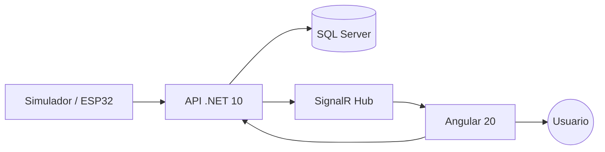
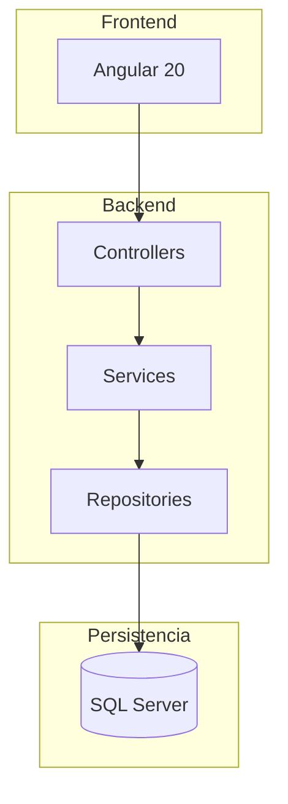
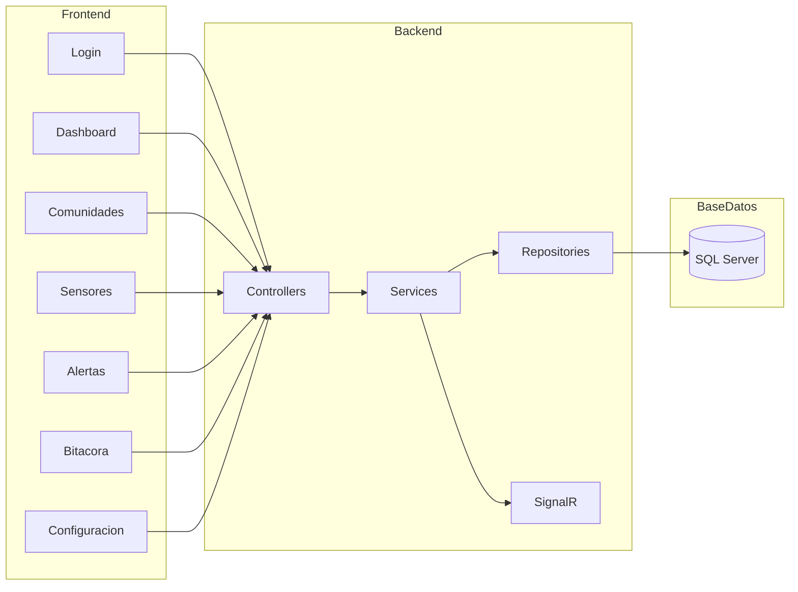
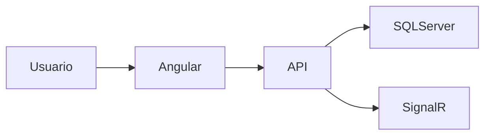

# ClimGuard
## Arquitectura del Sistema

| Proyecto | ClimGuard |
|-----------|-----------|
| Documento | Arquitectura del Sistema |
| Código | DOC-13 |
| Versión | 1.0 |
| Estado | Finalizado |

---

# Objetivo

El presente documento describe la arquitectura de software implementada en ClimGuard.

Su propósito es mostrar la organización de los principales componentes del sistema, la comunicación entre ellos y las tecnologías utilizadas durante el desarrollo del primer release.

La arquitectura fue diseñada siguiendo una separación por capas, permitiendo desacoplar la interfaz de usuario, la lógica de negocio y el acceso a datos, facilitando el mantenimiento, la escalabilidad y futuras integraciones con sensores físicos.

---

# 1. Arquitectura General

ClimGuard está compuesto por una aplicación web desarrollada en Angular, una API REST implementada en .NET 10, una base de datos SQL Server 2022 y un servicio de comunicación en tiempo real mediante SignalR.

Actualmente las lecturas provienen de datos simulados; sin embargo, la arquitectura permite sustituir esta fuente por dispositivos físicos sin modificar el resto del sistema.

---

# 2. Arquitectura por Capas

El sistema se encuentra organizado mediante una arquitectura por capas, donde cada componente posee una responsabilidad claramente definida.

## Descripción de las capas

| Capa | Responsabilidad |
|------|-----------------|
| Frontend | Presentación de la información e interacción con el usuario. |
| Controllers | Recepción de solicitudes HTTP y exposición de la API REST. |
| Services | Implementación de la lógica de negocio del sistema. |
| Repositories | Acceso a la base de datos mediante consultas y persistencia de información. |
| SQL Server | Almacenamiento permanente de la información del sistema. |

---

# 3. Diagrama de Componentes

El siguiente diagrama representa los principales componentes funcionales implementados en ClimGuard y la comunicación existente entre ellos.

---

# 4. Flujo General de la Información

El flujo de procesamiento de la información dentro del sistema se realiza de la siguiente manera:

1. El usuario interactúa con la aplicación Angular.
2. Angular consume los servicios expuestos por la API REST.
3. Los Controllers reciben la solicitud.
4. Los Services ejecutan la lógica de negocio.
5. Los Repositories realizan las operaciones sobre SQL Server.
6. Cuando ocurre una actualización relevante (por ejemplo, una nueva lectura o una alerta), SignalR notifica automáticamente al frontend.
7. Angular actualiza la interfaz sin necesidad de recargar la página.

---

# 5. Tecnologías Utilizadas

| Componente | Tecnología |
|------------|------------|
| Frontend | Angular 20 |
| Backend | .NET 10 Web API |
| Comunicación Cliente-Servidor | REST |
| Comunicación en tiempo real | SignalR |
| Base de Datos | SQL Server 2022 |
| Contenedores | Docker |
| Control de versiones | Git |
| Repositorio | GitHub |

---

# 6. Patrones Arquitectónicos Utilizados

| Patrón | Aplicación |
|---------|------------|
| Arquitectura por capas | Separación entre presentación, lógica de negocio y acceso a datos. |
| Repository | Encapsula el acceso a la base de datos. |
| Service Layer | Centraliza la lógica de negocio del sistema. |
| Dependency Injection | Utilizado por .NET para la gestión de dependencias. |
| API REST | Comunicación entre Angular y el backend. |
| Publish / Subscribe | Implementado mediante SignalR para actualizar información en tiempo real. |

---

# 7. Despliegue

Durante el desarrollo del proyecto todos los componentes se ejecutan mediante contenedores Docker.

La utilización de Docker facilita la portabilidad del sistema y garantiza que todos los servicios puedan ejecutarse bajo una configuración uniforme en diferentes entornos.

---

# 8. Escalabilidad

La arquitectura implementada permite incorporar nuevas funcionalidades sin modificar significativamente la estructura existente.

Entre las posibles ampliaciones futuras se encuentran:

- Integración con sensores físicos mediante ESP32 u otros microcontroladores.
- Incorporación de nuevos tipos de sensores.
- Envío de notificaciones mediante correo electrónico o SMS.
- Integración con servicios meteorológicos externos.
- Despliegue en infraestructura en la nube.

---

# 9. Consideraciones de Diseño

Durante el desarrollo del primer release se tomaron las siguientes decisiones arquitectónicas:

- La comunicación entre el frontend y el backend se realiza exclusivamente mediante una API REST.
- La actualización en tiempo real del dashboard se implementa mediante SignalR.
- Los datos utilizados para las gráficas corresponden actualmente a información simulada.
- La persistencia de la información se realiza en SQL Server 2022.
- Los servicios del sistema se ejecutan utilizando contenedores Docker.

---

# Observaciones

- La arquitectura implementada favorece el mantenimiento y la evolución del sistema mediante una clara separación de responsabilidades.
- La incorporación futura de sensores físicos no requerirá cambios significativos en el frontend ni en la estructura general de la aplicación.
- El presente documento describe la arquitectura correspondiente al primer release de ClimGuard.